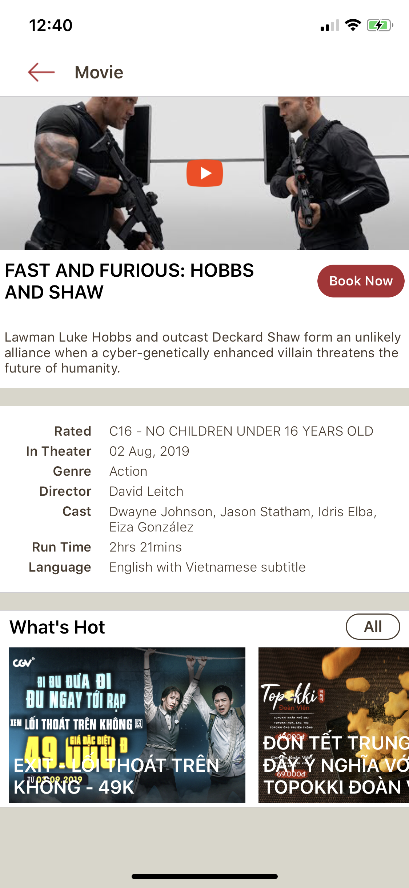
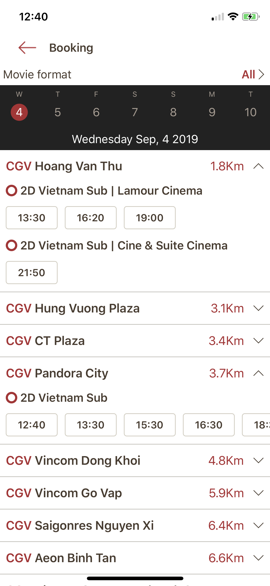

# CGV Demo

Application clone from CGV on appstore

&nbsp;&nbsp; &nbsp;&nbsp; 


## Requirements

- Runs on iOS 10.0 and later
- Swift 5.0  and ARC.

## Installation

Please run pod install before run project.

```ruby
pod install
```
## Information

- Architecture: Clean Architecture, MVVM.
- Framework: RxSwift

## References

- https://github.com/sergdort/CleanArchitectureRxSwift
- http://blog.cleancoder.com/uncle-bob/2012/08/13/the-clean-architecture.html

## Contact

If you have any question about this project, please contact me via email: dhnghia22@gmail.com

